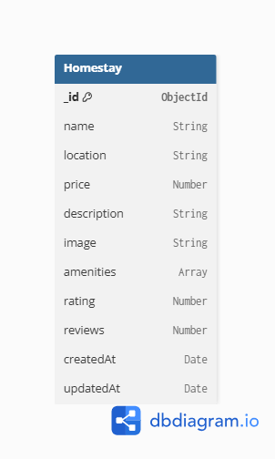

# SmartStay

SmartStay is a responsive homestay management web application designed to simplify property listings, booking management, and guest interactions. The project is being developed as part of the TBI GEU Summer Internship Program 2026 and focuses on creating a modern, user-friendly platform for homestay owners and travelers.

## Features

### Homestay Listings

* Browse featured homestays in a responsive grid layout.
* View essential details such as location, pricing, and availability.
* Clean and user-friendly card-based design.

### Property Details

* Dedicated detail pages for individual homestays.
* Display accommodation information, amenities, and pricing details.

### Authentication UI

* Login page for existing users.
* Registration page for new users.
* Form-based user interface for future authentication integration.

### Host Dashboard

* Booking statistics and occupancy insights.
* Recent bookings table.
* Dashboard widgets and summary cards.

### Responsive Design

* Mobile View (375px)
* Tablet View (768px)
* Desktop View (1440px)

### Dark / Light Mode

* Theme toggle functionality.
* Theme preference stored in localStorage.
* Consistent experience across all pages and components.

### Reusable UI Component Library

Located in `src/components/ui`

* Button Component
* Input Component
* Modal Component
* Toast Component
* Loader Component

All components are reusable, documented using JSDoc comments, and designed to support future scalability.

---

## Pages

### Home

Landing page featuring:

* Navbar
* Hero Section
* Featured Homestays
* Feature Highlights
* Footer

### Login

User authentication interface.

### Register

New user registration interface.

### Listings

Browse available homestays.

### Details

Detailed view of a selected homestay.

### Dashboard

Host management dashboard with metrics and booking information.

### About

Information about the SmartStay platform.

### Not Found

Fallback page for invalid routes.

---

## Tech Stack

### Frontend

* React.js
* React Router DOM
* Tailwind CSS

### Backend

* Node.js
* Express.js

### Database

* MongoDB Atlas
* Mongoose ODM

### Development Tools

* Git
* GitHub
* VS Code


### Database Choice and Why

MongoDB Atlas was selected because SmartStay stores flexible, document-based homestay information such as names, locations, prices, amenities, ratings, and reviews. It integrates seamlessly with Node.js and Express using Mongoose and provides scalable CRUD operations for the application.

### Schema Diagram

The current implementation contains a single MongoDB collection named **Homestay**.



### Set up the Database

1. Create a MongoDB Atlas account and a new cluster.
2. Create a database user and whitelist your current IP address.
3. Copy the connection string and add it to the backend environment file:

```bash
cd backend
cp .env.example .env
```

Then update the file with your MongoDB connection string:

```env
MONGO_URI=mongodb+srv://<username>:<password>@cluster.mongodb.net/smartstay
```

4. Optional: set the frontend URL for CORS in the same file:

```env
FRONTEND_URL=http://localhost:3000
```

5. Start the backend server. The application will connect to MongoDB and seed sample homestay data automatically if the database is empty.

```bash
npm run dev
```

---

## Getting Started

### Clone the Repository

```bash
git clone https://github.com/AyushiBhatt1101/SmartStay.git
```

### Navigate to Project Directory

```bash
cd SmartStay
```

### Install Dependencies

```bash
npm install
```

### Start Frontend Development Server

From the project root, run:

```bash
npm start
```

The frontend will be available at `http://localhost:3000`.

### How to run backend locally

Open a new terminal in the project root and run:

```bash
cd backend
npm install
cp .env.example .env
npm run dev
```

The backend server will start at `http://localhost:5000`.

Useful notes:

- The backend uses Express and serves homestay data through API endpoints such as `/api/homestays` and `/api/homestays/:id`.
- The default port is `5000`, and it can be changed using the `PORT` variable in the backend `.env` file.
- The frontend is configured to connect to the backend via `FRONTEND_URL` in the backend environment settings.

If you want to run the backend in production mode:

```bash
cd backend
npm start
```

---

## API Endpoints

| Method | Endpoint | Description |
|--------|----------|-------------|
| GET | /api/homestays | Get all homestays |
| GET | /api/homestays/:id | Get a homestay by ID |
| POST | /api/homestays | Create a new homestay |
| PUT | /api/homestays/:id | Update a homestay |
| DELETE | /api/homestays/:id | Delete a homestay |

---

## Future Enhancements

* User authentication and authorization
* Homestay booking management
* Wishlist functionality
* User profile management
* AI-powered review analysis
* Personalized homestay recommendations
* Trip planning assistance

---

## Author

Ayushi Bhatt

B.Tech Computer Science Engineering

TBI GEU Summer Internship Program 2026
